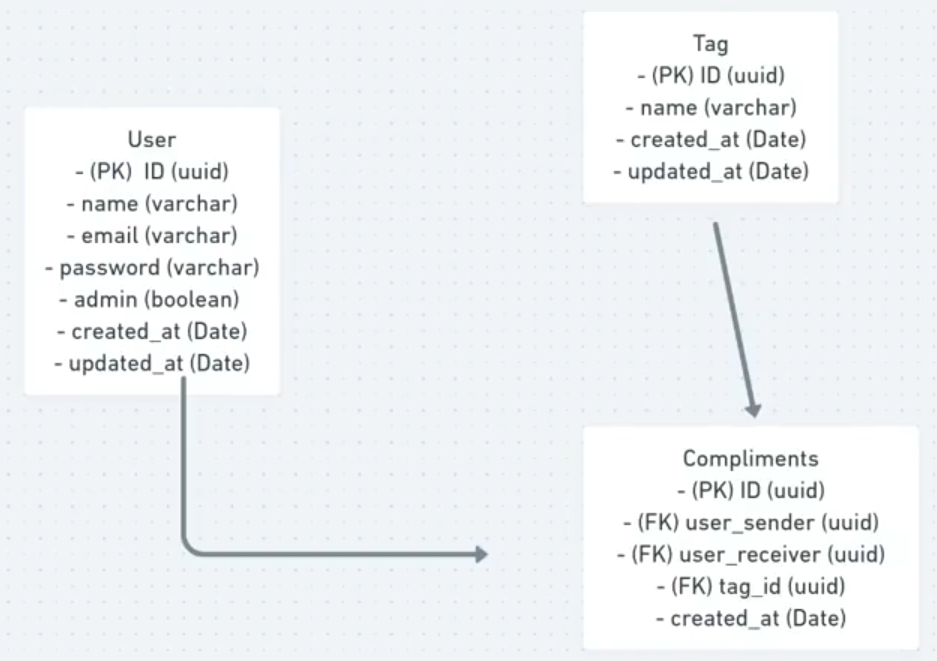

# NLW Together - Ferramenta de Elogios

Essa aplicação foi feita a partir do curso NLW Together - Node, da Rocketseat

## Conteúdo

- [Overview](#overview)
  - [The challenge](#the-challenge)
  - [Screenshot](#screenshot)
  - [Links](#links)
- [My process](#my-process)
  - [Built with](#built-with)
  - [What I learned](#what-i-learned)
- [Author](#author)

## Overview

### O desafio

A aplicação deve:

- [x] Cadastrar usuário
- [x] Cadastrar Tags de Elogios (Apenas administrador)
- [x] Cadastrar Elogios
- [x] Autenticar Usuário
- [x] Listar Usuários
- [x] Listar Tags
- [x] Listar Elogios enviados por usuário
- [x] Listar Elogios recebidos por usuário

### Screenshot



## Meu processo

### Contruído com

- Node
- Typescript
- PostgreSQL
- Express
- Princípios SOLID

### Recursos

- [uuid](https://www.npmjs.com/package/uuid) - Utilizado para geração de uuids na criação de entidades.
- [tsx](https://www.npmjs.com/package/tsx) - Utilizado para rodar typescript sem precisar fazer build.
- [bcryptjs](https://www.npmjs.com/package/bcryptjs) - Utilizado para fazer criptografia de senhas.
- [express-async-errors](https://www.npmjs.com/package/express-async-errors) - Utilizado para que o express consiga tratar erros lançados em métodos assíncronos.
- [jsonwebtoken](https://www.npmjs.com/package/jsonwebtoken) - Utilizado para realizar a autenticação de usuários na aplicação.

## Utilizando a aplicação

Caso queira clonar o repositório e utilizar essa aplicação, para que a conexão com o banco funcione, você precisa inserir os dados do seu banco de dados no arquivo de conexão ou inserir esses dados em um arquivo de variáveis de ambiente com o mesmo nome da conexão:

```ts
const createConnection = async () => {
  const client = new Pool({
    host: "localhost",
    port: 5432,
    user: process.env.DB_USERNAME,
    password: process.env.DB_PASSWORD,
    database: process.env.DB_BASENAME,
  });

  await client.connect();
  return client;
};
```

## Autor

- LinkedIn - [@YanBatista](https://www.linkedin.com/in/yanbatista/)
